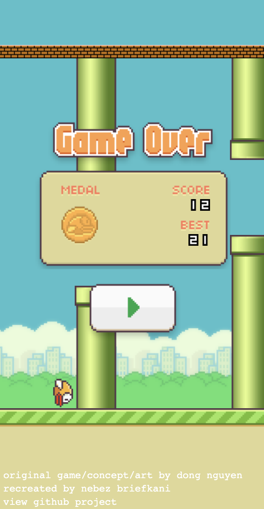

# [play floppy bird](https://nebezb.com/floppybird/)

If you missed the Flappy Bird hype, here's your chance to try the best vintage knockoff.

**Features**

* 🎉 good ol' div's for all the objects and graphics,
* 🖥 scales perfectly on almost any screen, both mobile and desktop,
* 💩 unoptimized, laggy, and not nearly as fast as a canvas implementation,
* 👷‍♂️ a typescript version that does almost nothing better over at [ts-floppybird](https://github.com/nebez/ts-floppybird)!

Enjoy.

https://nebezb.com/floppybird/ (or play [**easy mode**](https://nebezb.com/floppybird/?easy))

### Clones

* https://wanderingstan.github.io/handybird/
    * **[@wanderinstan](https://github.com/wanderingstan)** enables hand gestures to play using doppler effect and a microphone
* http://www.hhcc.com/404
    * **[Hill Holiday](http://www.hhcc.com/)** using it for their 404
* http://heart-work.se/duvchi
    * promotional campaign for an album release
* https://www.progressivewebflap.com/
    * **[@jsonthor](https://twitter.com/jsonthor)** lets you take floppy bird with you as a progressive web app
* https://github.com/rukmal/FlappyLeapBird
    * **[Rukmal](http://rukmal.me/)** integrates the LeapMotion Controller
* http://chrisbeaumont.github.io/floppybird/
    * **[@chrisbeaumont](https://github.com/chrisbeaumont)** puts the bird on auto-pilot
* http://www.lobe.io/flappy-math-saga/
    * **[@tikwid](https://github.com/tikwid)** teaches you math
* http://dota2.cyborgmatt.com/flappydota/
    * flappy dota
* http://labs.aylien.com/flappy-bird/
    * **[@mdibaiee/flappy-es](https://github.com/mdibaiee/flappy-es)** brings skynet to floppy bird
* https://emu.edu/gaming-hub/flappy-huxman-game/
    * university celebrates 100 years by putting President Susan Huxman on a floppy bird body
* https://www.docker.com/blog/creating-the-kubecon-flappy-dock-extension/
    *  a Docker-themed fork that was turned into a Docker Extension for KubeCon EU 2022 ([source available here](https://github.com/mikesir87/floppybird))
* http://flappydragon.attim.in/
    * **[@iarunava/flappydragon](https://github.com/iarunava/flappydragon)** redesign flappy bird for Game of Thrones.

### Koinos Blockchain Integration

This version of FloppyBird includes integration with the Koinos blockchain, featuring:

* 🔐 Connect your Koinos wallet using [Kondor](https://chrome.google.com/webstore/detail/kondor/ghipkefkpgkladckmlmdnadmcchefhjl)
* 🏆 Submit your high scores to a global leaderboard on the blockchain
* 📊 View the top scores from players around the world
* 🌐 Decentralized score storage - your achievements are permanently recorded!

#### Playing the Game:

1. Install the Kondor wallet extension
2. Click "Connect Wallet" in the game
3. Play the game and achieve a high score
4. Click "Submit Score" to record your score on the blockchain
5. Click "Leaderboard" to see the global rankings

#### Deploying Your Own Version:

To deploy your own version of the FloppyBird leaderboard:

1. Follow the detailed instructions in [DEPLOYMENT.md](./DEPLOYMENT.md)
2. Build the smart contract using the AssemblyScript SDK
3. Deploy to either the Koinos testnet (Harbinger) or mainnet
4. Update the `SCOREBOARD_CONTRACT_ADDRESS` in `js/wallet.js` with your deployed contract address

For developers interested in the smart contract implementation, check the AssemblyScript code in the [assembly](./assembly) directory.

### Notice

The assets powering the visual element of the game have all been extracted directly from the Flappy Bird android game. I do not own the assets, nor do I have explicit permission to use them from their creator. They are the work and copyright of original creator Dong Nguyen and .GEARS games (http://www.dotgears.com/).

I took this Tweet (https://twitter.com/dongatory/status/431060041009856512 / http://i.imgur.com/AcyWyqf.png) by Dong Nguyen, the creator of the game, as an open invitation to reuse the game concept and assets in an open source project. There is no intention to steal the game, monetize it, or claim it as my own.

If the copyright holder would like for the assets to be removed, please open an issue to start the conversation.
